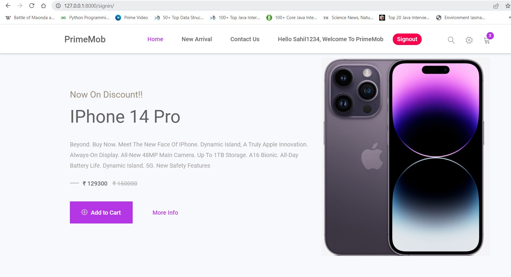
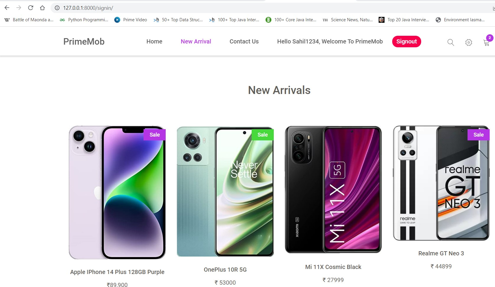

# PrimeMob

PrimeMob is an exclusive online store for buying wide variety of Smartphones and Tablets. This E-Commerce website is developed in Python-Django.
## Submission details
Name:- Sahil Rana
UID:- 21MCC2110

## Objective
To create a webapp of any theme with login/logout flow which will be connected with Database.
Create a contac us page. Data submitted should be collected in Database.
Website should be responsive for desktop and mobile devices.
Host it on Github/Heroku.


## Technologies

* Front End:- HTML, CSS, BootStrap
* Back End:- Python, Django Framework,Sqlite Database
* Cloud:- Heroku


## Outcome
- This webapp PrimeMob will present a Signup and Signin page to the user.
- An E-commerce website will popup after successfully signing in.
- User can browse through the products and the carousel.
- Contact us page is given for submitting the user query.
- Signout button is also given to signout of the webapp.
- User form data will be collected in Model.
- We can see that data by having the superuser access.

## Getting Started


* Install django on system

```bash
  pip3 install django
```
* Creating Project
```
 django-admin startproject parentapp
 python manage.py runserver
```
* Starting the app inside parentapp
```
 python manage.py startapp baseapp
```

    
## Building Project
* Edit the urls.py file of parentapp to call it to baseapp urls.py
```
from django.contrib import admin
from django.urls import path,include
from django.http import HttpResponse

urlpatterns = [
    path('admin/', admin.site.urls),
    path('',include('baseapp.urls')),
]
```
* Now make a urls.py file in baseapp and define function calls
```
from . import views
from django.contrib import admin
from django.urls import path, include
from django.http import HttpResponse


urlpatterns = [
    path('',views.register,name='register'),
    path('signup/',views.signup,name='signup'),
    path('signin/',views.signin,name='signin'),
    path('signout/',views.signout,name='signout'),
    #path('home/',views.home,name='home'),
]
```

* In views.py, write functions to define their functionality
```
from django.shortcuts import render,redirect
from django.http import HttpResponse
from django.contrib.auth.models import User
from django.contrib import messages
from django.contrib.auth import authenticate,login,logout

def register(request):
    return render(request,'baseapp/register.html')

def signup(request):
    if request.method == "POST":
        username = request.POST.get("name")
        email = request.POST.get("email")
        pass1 = request.POST.get("pass1")
        pass2 = request.POST.get("pass2")

        reg_user = User.objects.create_user(username,email,pass1)
        reg_user.save()
        messages.success(request, "Your account has been successfully created!!")
    return render(request,'baseapp/register.html')

def signin(request):
    if request.method == "POST":
        username = request.POST.get('username')
        pass1 = request.POST.get('pass1')
        user = authenticate(username = username,password = pass1)

        if user is not None:
            login(request,user)
            uname = user.username
            return render(request,'baseapp/home.html',{'fname':uname})
        else:
            messages.error(request,'Wrong Credentials')
    return render(request,'baseapp/register.html')

def signout(request):
    logout(request)
    #messages.success(request,"Logged out successfully!!")
    return redirect('signup')
```
* Now make a templates folder inside baseapp to store html templates
* To make user registration, django built in modules are used.
* Create the admin user with 
```
    python manage.py createsuperuser
```
* Enter desired username and password. At localhost/admin you will be able to see the collected data in database.


## Defining Database
* We will edit our Models.py file to collect our contact us form data.
```
from django.db import models

class Contact(models.Model):
    name = models.CharField(max_length=122)
    email = models.EmailField(max_length=122)
    phone = models.IntegerField()
    msg = models.TextField(max_length=255)
    date = models.DateField()

    def __str__(self) -> str:
        return self.name
```
* Define its function in views.py and then register this model in admin.py file.
```
    from django.contrib import admin
    from baseapp.models import Contact
    # Register your models here.
    admin.site.register(Contact)
```
* Now run these commands to propogate changes to our model into database schema.
```
    python manage.py makemigrations
    python manage.py migrate
```
## Run Locally
* Screenshots of Local implementation of app


- Screenshot 2


## Super User/ Admin 
